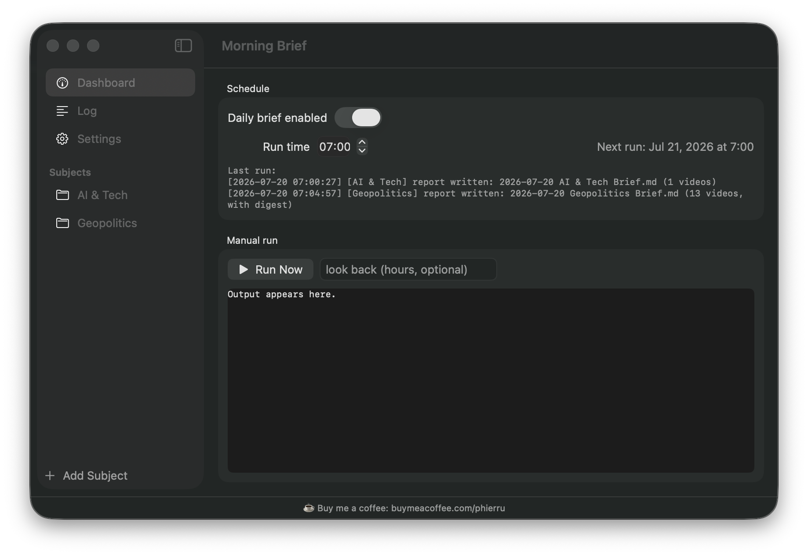

# Morning Brief

Wake up to a daily markdown briefing of the YouTube channels you actually care
about — summaries, key takeaways, and product links, without watching hours of
video.

Every morning, Morning Brief checks your chosen channels for new videos, pulls
their transcripts, has [Claude](https://claude.com/claude-code) summarize each
one, and writes one note per **subject** (e.g. *AI & Tech*, *Geopolitics*) into
a markdown folder of your choice — an Obsidian vault works beautifully. Each
note opens with a cross-video digest (top themes + at-a-glance list), followed
by per-video sections: summary, key takeaways, and the products/sources
mentioned, with links back to each video.

A native macOS menu bar app (SwiftUI) manages the whole thing: enable/disable
the schedule, change the run time, trigger manual runs with live output.

## How it works

1. **Detection** — each channel's public RSS feed
   (`youtube.com/feeds/videos.xml?channel_id=…`). No YouTube API key needed.
2. **Transcripts** — [yt-dlp](https://github.com/yt-dlp/yt-dlp) downloads the
   (auto-)captions; no video download.
3. **Summaries** — the `claude` CLI writes per-video sections and the daily
   digest.
4. **Delivery** — one markdown note per subject per day in
   `<vault_path>/<report_dir>/<Subject>/`.
5. **Scheduling** — a macOS LaunchAgent runs the pipeline daily; if the Mac is
   asleep at the scheduled time, it runs on wake.

Robustness: seen-video state prevents duplicates; Shorts (< 2 min) are
skipped; livestreams and just-published videos without captions are deferred
to the next run; network and Claude calls retry; a lockfile prevents
overlapping runs.

## Requirements

- macOS 14+
- Python 3.10+
- [Claude Code](https://claude.com/claude-code) CLI (`claude`), authenticated
- Xcode toolchain (only if you want to build the management app)

## Setup

```sh
git clone https://github.com/phierru/youtube-morning-brief.git
cd youtube-morning-brief

# 1. Python environment
python3 -m venv .venv
.venv/bin/pip install yt-dlp

# 2. Configuration
cp config.example.json config.json
#    edit config.json: your subjects/channels and the output folder

# 3. Try it
.venv/bin/python morning_brief.py --lookback 48

# 4. Schedule it (daily at 07:00, or pass e.g. `8 30` for 08:30)
./install_agent.sh 7 0
```

To find a channel's ID: open the channel page, view source, and search for
`externalId` — or paste the channel URL into the Mac app, which resolves it
for you.

### config.json

| Key | Meaning |
|---|---|
| `subjects` | list of briefs; each has a `name` and its `channels` (name + channel ID) |
| `vault_path` | absolute path to your markdown folder / Obsidian vault |
| `report_dir` | subfolder for the briefs, one sub-subfolder per subject |
| `lookback_hours` | how far back each run looks (dedup makes overlaps safe) |
| `min_duration_seconds` | videos shorter than this are skipped (Shorts filter) |
| `transcript_defer_hours` | wait this long for captions before falling back to description-only |
| `max_transcript_chars` | transcript truncation before summarization |
| `claude_model` | model passed to `claude -p` |

## The Mac app



```sh
MorningBriefApp/build.sh   # builds and installs "Morning Brief.app" to /Applications
```

The app is a thin frontend over the same files the pipeline uses — everything
it does can also be done by hand:

- **Enable/disable** the daily schedule (drives `launchctl`)
- **Change the run time** (rewrites the LaunchAgent plist and reloads it)
- **Run Now** with an optional look-back override, streaming live output
- Status: next run, last run outcome, run-in-progress detection

If your checkout isn't at `~/Projects/YouTubeMorningBrief`:

```sh
defaults write com.francescolardieri.morningbrief projectDir /path/to/checkout
```

## Development

See [docs/PRD.md](docs/PRD.md) for the product requirements,
[docs/ROADMAP.md](docs/ROADMAP.md) for what's next (Apple Intelligence
backend, bring-your-own-LLM), [CHANGELOG.md](CHANGELOG.md) for release
history, and the
[issue tracker](https://github.com/phierru/youtube-morning-brief/issues).

## License

[MIT](LICENSE)

---

☕ Buy me a coffee: https://buymeacoffee.com/phierru
